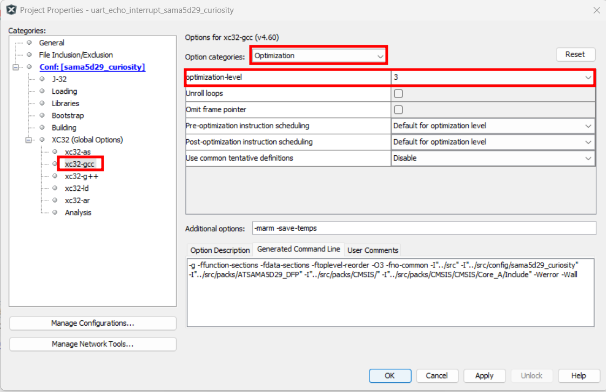

#  TensorFlow to MPLAB® Harmony v3 Model Converter

**Welcome to tf2mplabh3!**

This project is proudly developed and maintained by **Microchip Technology Inc.**  
It enables you to convert TensorFlow models to C code, ready for seamless integration into your MPLAB® Harmony v3 embedded projects.

---

## What is this?

`tf2mplabh3` is a command-line tool that automates the conversion of TensorFlow models to C code, making it easy to deploy machine learning models on embedded systems using MPLAB® Harmony v3.

---


## Table of Contents

- [Features](#features)
- [Installation](#installation)
- [Quick Start](#quick-start)
- [Usage](#usage)
- [Arguments](#arguments)
- [Examples](#examples)
- [How to use the hardware capabilities to accelerate inference](#how-to-use-the-hardware-capabilities-to-accelerate-inference)
- [Benchmarking](#benchmarking)
- [License](#license)
- [Acknowledgments](#acknowledgments)

---

## Features

- Convert TensorFlow SavedModel to C code
- Easy CLI interface
- Verbosity control for logging
- Ready for integration with MPLAB Harmony v3

---

## Installation
Clone the repository and run the installation script:
```bash
git clone --recursive https://github.com/MicrochipTech/tf2mplabh3.git
cd tf2mplabh3
sudo ./install.sh
```
### If you already cloned without --recursive, run:
```bash
git submodule update --init --recursive
```
---

## Quick Start
Activate the virtual environment and run the script, by passing the TensorFlow model path as shown in the example below:
```bash
source .venv/bin/activate
python3 -m tf2mplabh3 -m examples/mobilenet-v2-tensorflow2-035-128-classification-v2
```
---

## Usage
```bash
python3 -m tf2mplabh3 [options]
```
---

## Arguments

| Argument                    | Description                                 | Default                                                       |
|-----------------------------|---------------------------------------------|---------------------------------------------------------------|
| `-m`, `--model`             | Path to TensorFlow SavedModel directory     | `examples/mobilenet-v2-tensorflow2-035-128-classification-v2` |
| `-onnx`, `--onnx_model`     | Path to output ONNX intermediate model file | `examples/model.onnx`                                         |
| `-c_file`, `--c_model_file` | Path to output C model file                 | `examples/model.c`                                            |
| `--tag`                     | SavedModel tag (e.g., `serve`)              | `None`                                                        |
| `--signature_def`           | Signature def key (e.g., `serving_default`) | `None`                                                        |
| `--onnx2c`                  | Path to the onnx2c executable               | `c_deps/onnx2c/build/onnx2c`                                  |
| `-v`, `--verbosity`         | Verbosity level (`0`=quiet, `1`=all logs)   | `0`                                                           |
| `--overwrite`               | Overwrite existing ONNX or C model files    | `Not used`                                                    |

---
## Examples

### Convert a model with default settings:
```bash
python3 -m tf2mplabh3
```
### Convert a specific model and increase verbosity:
```bash
python3 -m tf2mplabh3 -m path/to/model -v 1
```
## How to use the hardware capabilities to accelerate inference:

In order to ensure an optimized inference time, leverage the features of the [MPLAB® XC-32 Compilers](https://www.microchip.com/en-us/tools-resources/develop/mplab-xc-compilers)
by activating the third level of compilation in your MPLAB® X project. Doing this ensures a extended use of the hardware capabilities of the 
device.

As shown in the example image below:



## Benchmarking

The following table shows the inference time for the example model (`mobilenet-v2-tensorflow2-035-128-classification-v2`) converted and run with different optimization levels.

**All benchmarks were performed on:**

- **Hardware:** Microchip [SAMA5D29 Curiosity Development  Board](https://www.microchip.com/en-us/development-tool/ev07r15a)
- **CPU:** 1x ARM® Cortex®-A5
- **Clock Frequency:** 498 MHz
- **Compiler:** XC32 v4.30

| Optimization Level | Inference Time (ms) | Notes/Flags Used   |
|--------------------|---------------------|--------------------|
| None               | 7536.600            | No optimization    |
| -O1                | 1731.100            | Basic optimization |
| -O2                | 1371.700            | More optimization  |
| -O3                | 1190.00             | Optimize for speed |
| -Os                | 1382.300            | Optimize for size  |

**Note:**  
Inference time was measured as the average over 100 runs.  
Results may vary depending on compiler version, memory configuration, and other system activity.

## License

[Apache-2.0 License](LICENSE)

## Acknowledgments

- [tf2onnx](https://github.com/onnx/tensorflow-onnx)
- [onnx2c](https://github.com/kraiskil/onnx2c)
- [TensorFlow](https://www.tensorflow.org/)